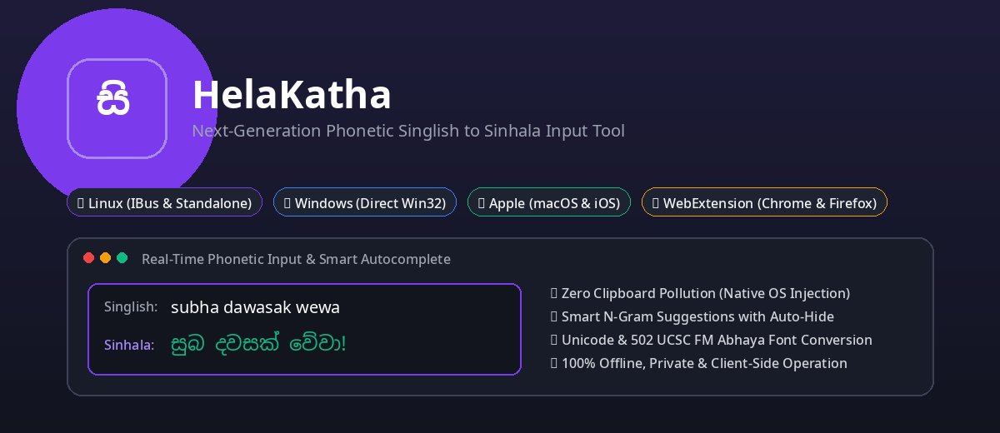
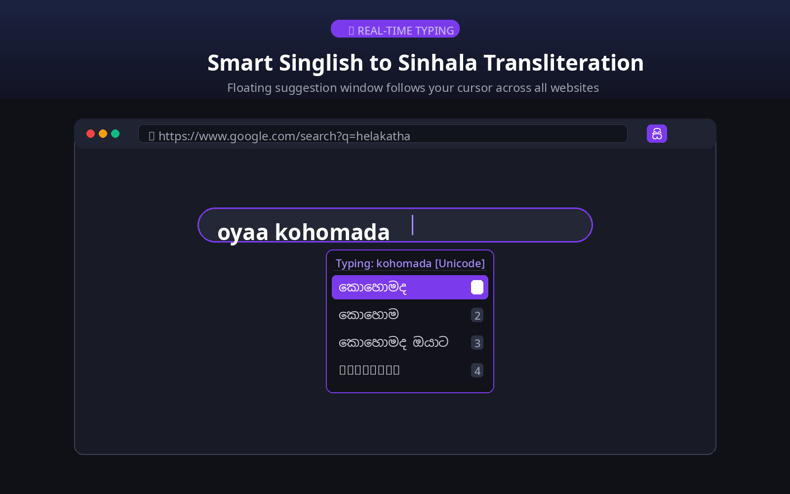
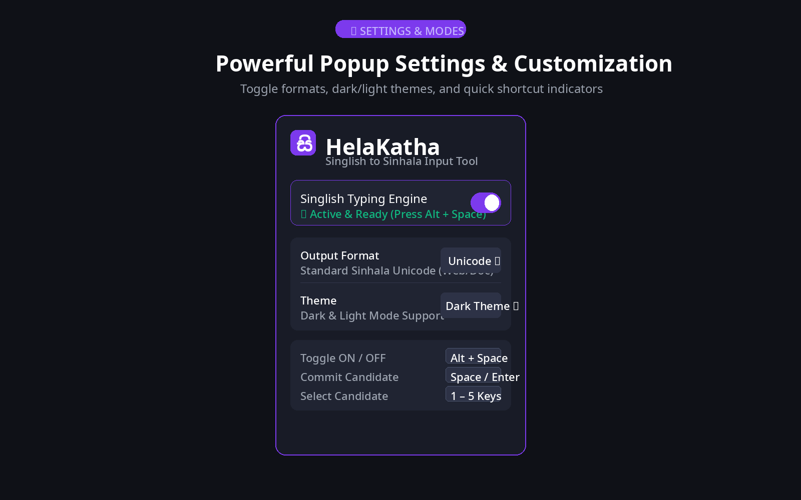
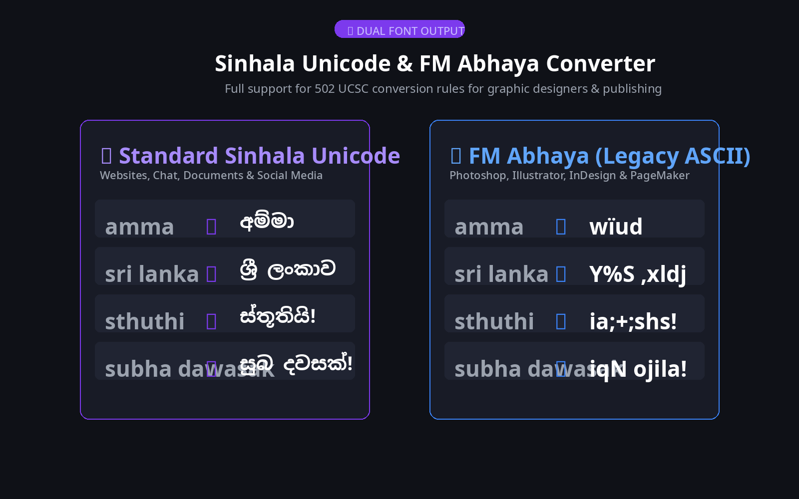

# HelaKatha (Singlish to Sinhala Input Tool)

<p align="center">
  
</p>

A production-grade, multi-platform phonetic **Singlish to Sinhala Input Method Engine & WebExtension** designed for **Linux**, **Windows**, **Apple (macOS & iOS)**, and **Web Browsers (Chrome & Firefox)**.

HelaKatha translates phonetic Singlish syllables (e.g. `amma` ➔ `අම්මා`) into accurate Sinhala Unicode and Legacy font codes, featuring N-gram sentence predictions, auto-learning dictionaries, spelling correction, dynamic text expansion macros, and emoji lookups with **zero clipboard pollution**.

---

## 🏛️ Multi-Platform Architecture

```text
singlish-input-tool/
├── core/                         # Shared Cross-Platform Transliteration & Logic Engine
│   ├── engine.py                 # Phonetic rules, bigram predictions, macros, emoji, spell-check
│   └── __init__.py
│
├── linux/                        # Linux Native Engine & Standalone GUI
│   ├── ibus_engine.py            # Native IBus Input Method Daemon (Zero Clipboard)
│   ├── helakatha.xml             # IBus system component specification
│   ├── setup_ibus.sh             # One-click IBus installer script
│   ├── standalone/               # PyQt6 Desktop Standalone (Tray, OSD, Language Pill, Voice)
│   │   ├── main.py
│   │   ├── ui.py
│   │   └── run.sh
│   ├── debian/                   # Debian package layout
│   ├── helakatha_1.0.1-1_all.deb # Compiled Debian package
│   ├── build_linux.sh            # Debian package builder
│   └── README.md
│
├── windows/                      # Windows Native Direct Unicode Engine
│   ├── main.py                   # Win32 SendInput(KEYEVENTF_UNICODE) Direct Injection (Zero Clipboard)
│   ├── ui.py                     # Windows Catppuccin theme UI & Tray
│   ├── run.bat                   # Windows portable launcher
│   ├── install.bat               # Windows dependency installer
│   ├── build_installer.bat       # Standalone installer build script
│   └── README.md
│
├── apple/                        # macOS (InputMethodKit) & iOS (Keyboard Extension)
│   ├── macos/                    # macOS Native InputMethodKit App (Zero Clipboard)
│   │   ├── HelaKathaInputController.swift
│   │   ├── SinglishEngine.swift
│   │   ├── main.swift
│   │   ├── Info.plist
│   │   └── build_macos.sh
│   ├── ios/                      # iOS Custom Keyboard Extension (Zero Clipboard)
│   │   ├── KeyboardViewController.swift
│   │   ├── SinglishEngine.swift
│   │   └── Info.plist
│   └── README.md
│
├── extension/                    # Chrome & Firefox WebExtension (Manifest V3)
│   ├── manifest.json             # Cross-browser extension manifest (AMO validated)
│   ├── engine.js                 # Complete JavaScript transliteration core & 502 UCSC rules
│   ├── content.js                # Universal web page typing, caret hook & Alt+Space toggle
│   ├── floating_box.css          # Modern floating suggestion UI (Dark & Light themes)
│   ├── background.js             # Service worker & toolbar badge status
│   ├── popup.html / popup.js     # Settings & mode switcher dashboard
│   ├── icons/                    # App icons (16, 32, 48, 128px)
│   ├── screenshots/              # High-resolution store screenshot mockups
│   └── README.md
│
├── build_web_engine.py           # Core Python-to-JavaScript engine compiler
└── README.md                     # Root Project Guide
```

---

## 🚀 Platform Quickstart

### 1. 🐧 Linux
* **Native IBus Input Method (Zero Clipboard — Recommended):**
  ```bash
  cd linux
  chmod +x setup_ibus.sh
  ./setup_ibus.sh
  ```
  *Enable in GNOME / Desktop Settings ➔ Keyboard ➔ Input Sources ➔ Sinhala (HelaKatha Singlish).*

* **Standalone Desktop App:**
  ```bash
  ./run.sh
  ```
  *Or install the native `.deb` package:*
  ```bash
  sudo dpkg -i linux/helakatha_1.0.1-1_all.deb
  ```

---

### 2. 🪟 Windows
* **Zero-Clipboard Direct Unicode Injection:**
  1. Double-click `windows/install.bat` to install dependencies.
  2. Double-click `windows/run.bat` to start HelaKatha.
  3. Build standalone installer with `windows/build_installer.bat`.

---

### 3. 🌐 Web Browsers (Chrome, Brave, Firefox, Edge)
* **Google Chrome / Brave / Edge:**
  1. Open `chrome://extensions` ➔ Turn on **Developer mode**.
  2. Click **Load unpacked** ➔ Select the `extension/` folder.
* **Mozilla Firefox:**
  1. Open `about:debugging#/runtime/this-firefox`.
  2. Click **Load Temporary Add-on...** ➔ Select `extension/manifest.json`.

#### Browser Keyboard Controls:
| Key / Shortcut | Action |
| :--- | :--- |
| **`Alt + Space`** | Toggle Singlish typing **ON / OFF** (toolbar badge switches between `සි` and `EN`) |
| **`Space` / `Enter`** | Commit candidate word and strictly hide suggestion window |
| **`1` – `5`** | Directly select candidate word from the suggestion box |
| **`.` `,` `?` `!` `;`** | Auto-commit word with punctuation attached |

---

### 4. 🍏 Apple Devices (macOS & iOS)
* **macOS (InputMethodKit — Zero Clipboard):**
  ```bash
  cd apple/macos
  chmod +x build_macos.sh
  ./build_macos.sh
  ```
  *Enable in macOS System Settings ➔ Keyboard ➔ Text Input ➔ Input Sources ➔ HelaKatha.*

* **iOS / iPadOS (Custom Keyboard Extension):**
  * Open `apple/ios/` in Xcode and build the `UIInputViewController` keyboard extension for iPhone/iPad.

---

## 🔄 Setting Up After Cloning / Downloading (.gitignore Restoration)

When you clone or download this repository on a new machine, the ignored files can be restored effortlessly:

### 1. 🐍 Recreating the Virtual Environment (`.venv`)
* **Linux:** Run `./install.sh` (or `python3 -m venv .venv && .venv/bin/pip install -r windows/requirements.txt`).
* **Windows:** Double-click `windows/install.bat`.

### 2. 📦 Rebuilding Distribution Packages
* **Linux (`.deb`):** Run `./linux/build_linux.sh` to compile `linux/helakatha_1.0.1-1_all.deb`.
* **Windows (`.zip` / `.exe`):** Run `windows/build_installer.bat`.
* **WebExtension (`.zip`):** Zip the `extension/` directory.

### 3. ⚙️ User Settings & Personal Dictionaries
* **Automatic Initialization:** Fresh default configuration files (`settings.json`, `user_dict.json`, `macros.json`, `bigram_dict.json`) are automatically created the first time you run HelaKatha.
* **Migrating Existing History:** If you wish to migrate your personal typing history and custom macros, copy your config folder:
  * **Linux:** `~/.gemini/antigravity-cli/`
  * **Windows:** `%USERPROFILE%\.gemini\antigravity-cli\`

---

## 📸 Screenshots & Previews

| Real-Time Web Typing | Extension Popup & Settings | Dual Unicode & FM Abhaya Support |
| :---: | :---: | :---: |
|  |  |  |

---

## 🌟 Shared Core Features

* **Zero-Clipboard Text Injection:** Native OS text commits (`commit_text` on Linux, `SendInput` on Windows, `insertText` on Apple/Web).
* **Smart N-Gram Prediction:** Dynamic bigram sentence predictions learn from your writing style.
* **Text Expansion & Macros:** Custom shortcodes with dynamic variable templates (`[date]`, `[time]`).
* **Phonetic Spelling Correction:** Automatic detection and suggestions for dental vs. cerebral consonant typos.
* **Emoji Prefix Search:** Type `:` (e.g. `:smi`, `:hea`, `:lk`) for instant emoji insertion.
* **Unicode & Legacy FM Abhaya:** Supports 502 UCSC conversion rules for legacy publishing workflows.
* **100% Privacy:** Runs entirely client-side with zero tracking and zero telemetry.
